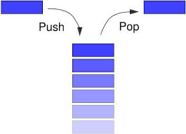
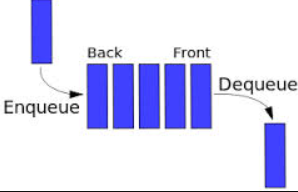

# Stack & Queue

Stack And Queue are a containers that we use it to store data in specific way and the special of this way is that the time comblexcity is `O(1)`.

## Stack

Stack is a series of node like a linked list but under conditions for add and remove that we call this way **FILO** `First In Last Out` .

this `FILO` takes about some rules
- you cant add any wear you need to add at the top just.
- you can remove it from the top element just.  

## queue

as the stack, queue it is a series of node like the linked list but under conditions for add and remove but that way is different we call this way **FIFO** `First In First Out`.

this `FIFO` is a take about other rules
- you cant add any wear you need to add at last just.
- you can remove and take element from first just.  

------

## [LearningJournal](./LearningJournal.md)