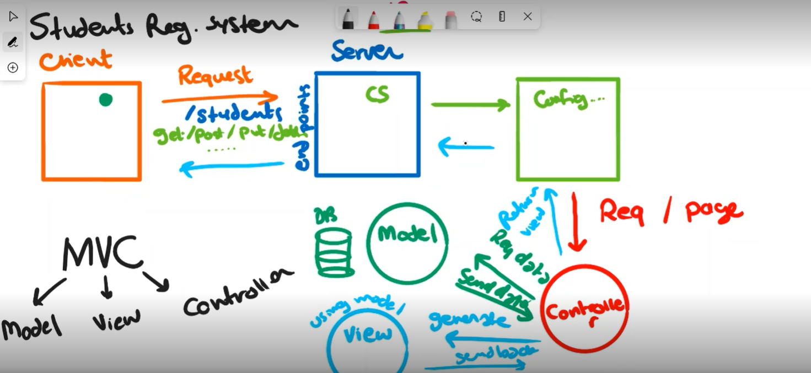

# LearningJournal

so today we take a lecture about the introduction to MVC, ERD and what is the data and database.

first of all we took about MVC and how the data transfer in **`MVC`**.

 `web browser` (send request)
    -> `server`(end point) 
       -> some `comfegration` 
           -> `controller` -> (the controller depend on the request decide what model we use ) `model`(model request data from `database`)
               -> (send data that we requer) `controller`
                     -> (controllar ask view to generate view depend on data from the model) `view` 
                        -> return from all this to retch web browser.    

then we take about some definition  

- DBMS: it is a software used to manage, read, store... etc data in the database.
- data: it is individual facts , images or elements.
- information: it is knowledge gained from research, organize and storing data.
- database: is a collection of data the organize and store in places.
- relation(tables) : it is a groupe of **collomns** (atripute) and **rows** (tuples)

then we take about some statement related on build of database and tables like `keys` and the relations.
