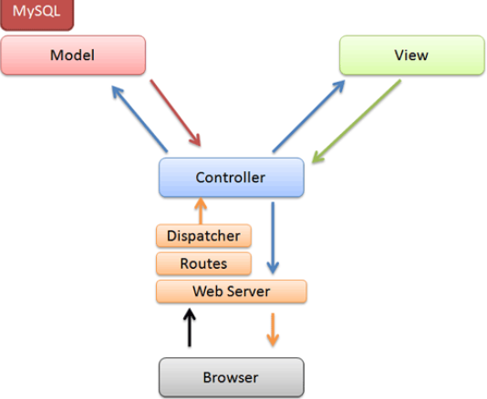
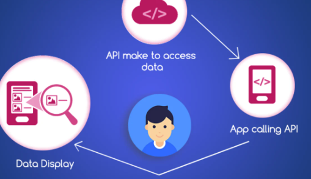

# Entity Framework Core

so from today we going to use Entity Framework Core a cross platform for our code and that is some different from `dotNet framewrok`.

in this part we will use ASP.NET Core from this we can start with a template for any ASP.net core like `MVC web app` `API` `Angular` ... etc.

what we will start with is the ASP.NET Core web app (MVC) and from this we will find a three folders created with our program class `Model` `view` `controller` and we will learn about how to start thinking for code in this way.

1. Model : here is what we will create and connect for the database and in this way making dealing with data is easier because we deal with classes so we can use `query & LINQ`.

and when we talking about the Model we going to take about `Data Seeding` or how we can enter data to our program.

2. view: here after we receive data we create a template in something named `Razor markup` to return it to the client.

3. controller: here we manage the whole process in `MVC` form choosing the correct model, send it to view until return it to the server. 

## Intro to APIs

API: a library or just some code transfer data with HTTP `json` or `xml` and in this way we can use it all over the internet.

then when we take about HTTP we have a stander build in method to access the resources we call it `CRUD`(Create-Read-update-delete) or with this method names (Post-Get-update-Delete).

for every resource access there is a **status code** to tell the user what happened in this response like :

- `200` means that is OK.
- `201` means that is OK and you create a new resource.
- `400` means that is NOT ok the client does something wrong.  
- `404` means that the resource is Not there or URI is wrong.
- `401` means that you don't have the authentication to retch the resource.
- `500` means that something is wrong in the server.

------

**[Learning Journal](./LearningJournal.md)**

---

**[← Back to LTUC Index](../ReadMeLTUC.md)**