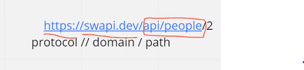
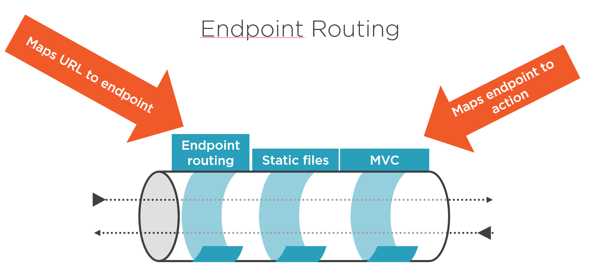

# Routing and Navigation Properties

first thing we will take about Routing in ASP.NET Core so any URL has three part 
1. protocol : (`http`,`FTP`,...etc) 
2. domain: the route for location in the server.
3. path: the Routing inside our program depend on controllers in MVC and API.

so in `Path` we can build the path in ASP.NET Core depend on something name `endpoint` and we can create it inside `Startup`->`Configure`->we create an endpoint and until now we have to endpoint:

1. `MapGet`,`MapPost` ... : in this way we create a single endpoint.
2. `MapControllers`: in this we use the route from controllers.

and inside controllers we have something named `DataAnnotations` we use it to specify the type of this request and id it have resources `{id}` or not.

then we have for were request `status code` to tell us what happened in this path request.

-------------

**[Learning Journal](./LearningJournal.md)**
