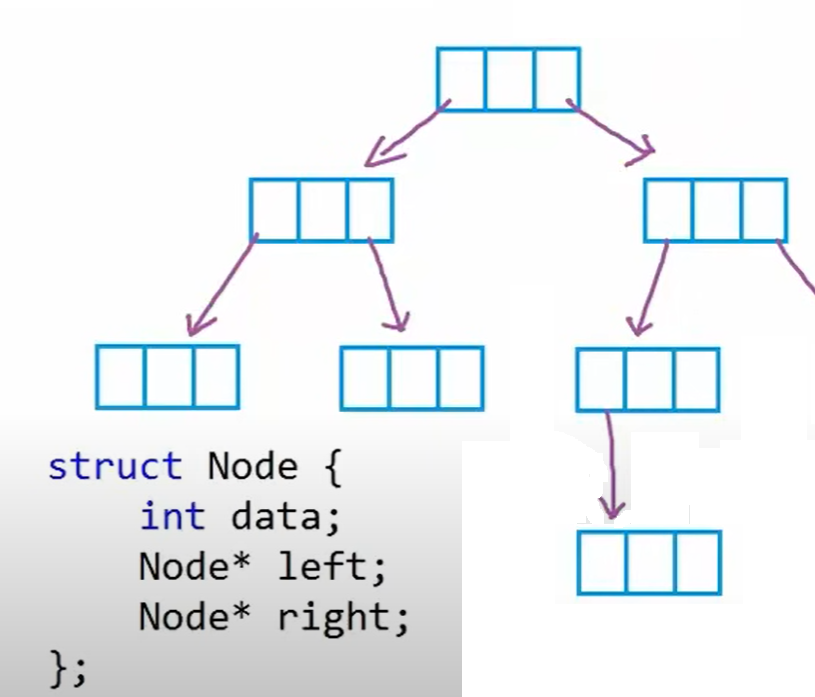

# Trees :palm_tree:

so what we take before this day is called `Linear data structures` like (`arrays`, `linked list`, `Stack`, `Queue` ) and this day we will take about trees.

Trees in seres of node, have type each type have his one condition and requirement and all shared that node is represented as hierarchy shape.

Trees types:  :key:

1. Binary Trees
2. Binary Search Trees
3. General Tree
4. K-ary Trees

Some keyWords:
- `root` = the first node and the only node don't have a parent.
- `parent` ,`grandparent`
- `children` `grandchildren`
- `sibling`= the node that has the same parent.
- `leef node`= the node that didn't link to other nodes (endpoint).
- `internal node`=the node that has links to other nodes (have children).
- `a is ancestors b`= if we can go from `a` to `b`.
- `b is descendant a`=if we can go from `a` to `b`.
- `depth`= number of edges (links) to reach the node.
- `height` = is the number of edges to reach the farthest leef from the node that i stand on.  

----

We usually use trees to store data like `file system in computer` and for quick search and for how we use it we create data as node linked together as hierarchy shape.

-----

**[Learning Journal](./LearningJournalTree.md)**
