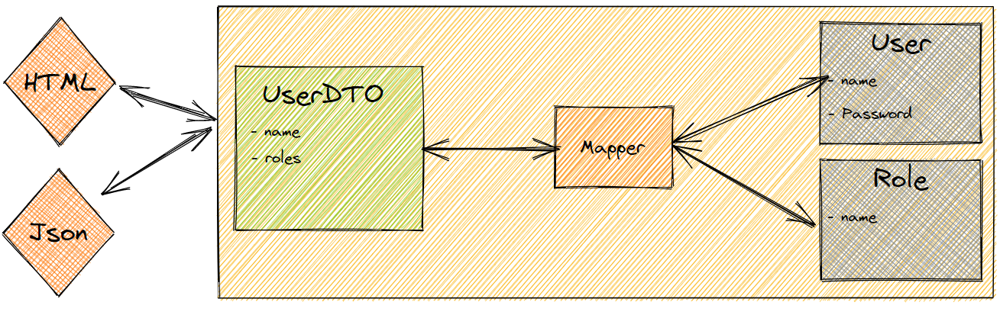
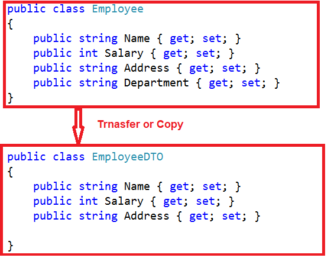

# DTOs :floppy_disk:
DTO it is a shortcut for `Data Transfer Object` and it is a class we use to modify what data we want to view from the object or to make it more presentable.

in this DTO we can filter data in the model to who the required data not all data OR to merge to model 

- security.
- ability to use data from other classes.
- make data more presentable.

 
## Create DTOs

in asp.net to create DTO in our project we have some general steps

1. create inside the model folder the DTO class as a class his name ends with `...DTO.cs`.

2. this class has the the property from model that we want to create DTO for it.

3. we remove the annotation because we didn't need to tell anything to the database we have what we want from the class that we create DTO for it.

---

-------
**[Learning Journal](./LearningJournal.md)**