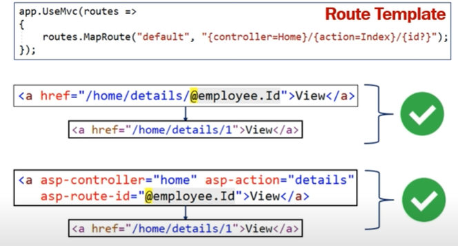
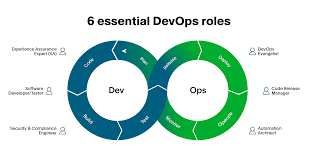

# Intro to MVC
## MVC
MVC :is a layout pattern that make from three-part (model - view - controller) that makes code less complex and easy to work with 

1. controller: to handle the request and access the to another part `model` and `view`
2. model: to handle the data logic and the way to deal with the data 
3. view: to how to represent the data 

**NOTE*
1. the model and the view never connect with each other
2. the model don't deal with request and the response and their status
3. the controller don't deal with how the data format and the database 

## Tag Helper 
a process on the server to render HTML element 

tag Helper is smaller than the HTML helper that we use in the view part 

## Azure DevOps

DevOps(Development + Operations)
it is a set of modern Microsoft services was called VSTS (visual studio team services) and now we
change it and that use for plan, collaborate and ship and help to fell the gape between `Development` + `Operations`

**Some Azure DevOps Service**
1. Boards 
2. Repos  
3. Pipeline
4. Test plans
5. Artifacts

----------------------
**[Learning Journal](./LearningJournal.md)**
