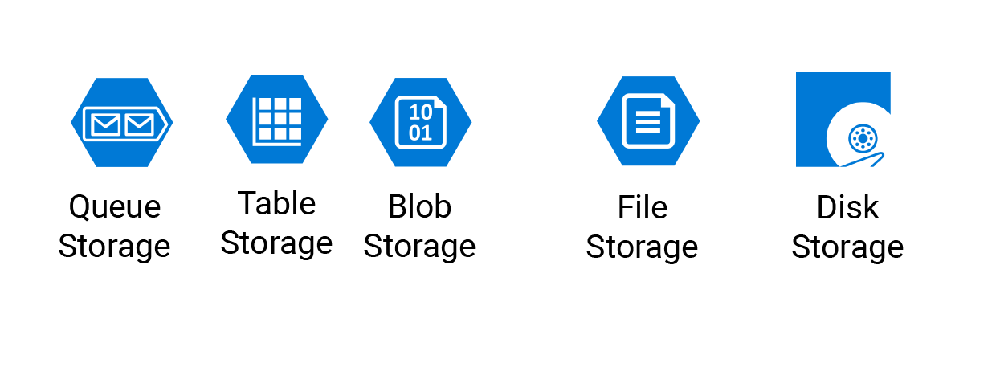

# Azure Blob Storage
what we use it
 store huge unstructured of data
types of blobs
1. block : huge unstructured of data
2. page: it is used for everything related to the backend 
3. append: use it when we want to append the data (we can just add to the end of data cant delete cant add to another place except the end )
## blob storge
there is storge in Microsoft Azura blobs
and we can divide it to three part
1. hot: in this the read and write operation is very fast
2. cold: in this the size for storing the data is very beg 
3. archive : in this we use it to dump huge unstructured  data

----------------------
**[Learning Journal](./LearningJournal.md)**

