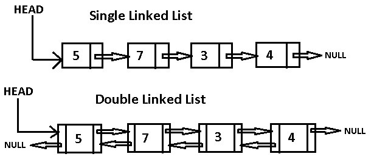

# linked lists

**linked lists** is a sequence of nodes eath node has to properties `Value` `the location for other Node` and we save the location for first node `Header` to get all elements.

**node** it is like one element of an array but has a location for another one element (node) .
**Header** the place we store the location for the first node.  

### linked lists Vs array

the main different between them is the way that they store , the Array in C# is static it book a specific part of memory to store its data and if this space cant fit in one part of memory it cant be created until the memory have this space in on block so because that they dont recommended array for larg space.
in the other way the linked list dynamic it didnt needs a specific size if we want to ad an element it will add another node in the linked list in any place in memory and the location for the place will store in the previous node so in this way linked list did Not need one block of memory it can put his element in any place in memory and save the location in the neighbors node.

Type of linked lists :-

1. single linked lists: in this type of linked lists every node has the location for **next node only**.

2. double linked lists: in this type of linked lists every node has the location for the next and previous node.

3. circular  linked lists: in this type of linked lists it is exact like single linked lists but the last node have location for the first node.

## Big O for frame
in the time complexity the class and function itself have time to be executed but we dont took about it because this time depends most likely on the computer and its hardware.

in the space complexity with the size of class and function there are the size of parameter and we call it **Input Size**.

