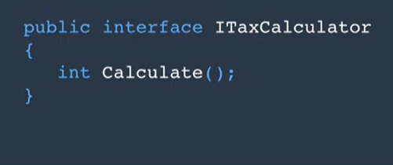

# Interface
The interface is like a method class that i can use in several classes.

The reason for using the interface is to make a class and his component (variable and method) is not totally related to each other and in this way we can easily replace it or use other features.

in interface we declare but not implementing the implementing happend in the class that inherent that interface
one of the benefits is i can use many interface `in the same class` unlike normal inherit, the name of and interface all programer start the name with `I`.

   

-----

## We use this power of code in abstract class and there is much similarity between both but also it not the same

**Abstract Class**|**Interface**
-----|-------
can implement some of members |cant implement anything
have access modifiers|it is always public
can inherit from anything |can inherit from just interface
can inherit from and for one thing|can inherit many interfaces in the same class