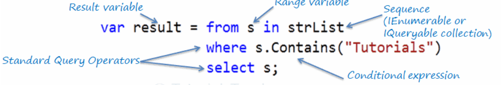

# LINQ
So we should take today about LINQ **Language Integrated Query** and what it is . it is way given in c# give us the ability to deal with query syntax.

and in C# and dotNet we can write it in two way as `methods syntax and `query syntax in both way LINQ have many commands in it and the most used command is 

- WHERE :  Used for filtering the require data from all the data.
- ORDERBY :  Used for ordering the data based on some conditions.
- SELECT :  Used for selecting property out of an object or other data

and we use it in many places like :

<<<<<<< HEAD

=======
>>>>>>> 911c3660b893add04df370d7aac5770eb8bd0ec3
