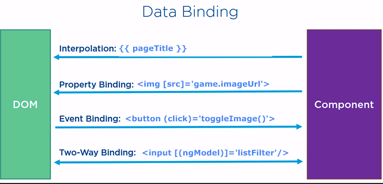

# types of angular data binding


## summary
```  
1.Data Binding    
    1. Interpolation
        {{expression}} 

    2. Property binding
    // in .ts file 
    {
      const status=true;
    }
    <button [disabled]="status"></button>

    3. Two-way binding: 
    Use [()] to listen for events and update 
    values simultaneously between parent and child components 
2.Event binding
    1. Event binding
        <button (click)="doSomething()">Click me</button> 
```
## Data Binding

1. string Interpolation (One-Way Binding (Output)):
    You can use interpolation to display a date in your template.

    For example:
    in your html

    ```html
    <p>{{ currentDate }}</p>
    ```

    In your component, you would have:

    ```typescript
    Copy code
    export class MyComponent {
      currentDate = new Date();
    }
    ```

2. Property Binding (One-Way Binding (Output)):

    You can bind a date to an input field using property binding.
    For example:

    in your html

    ```html
    <input [value]="currentDate" type="date">
    ```

    In your component:

    ```typescript
    export class MyComponent {
      currentDate = new Date().toISOString().substring(0, 10); // Use a string for input[type="date"]
    }
    ```

3. Two-Way Data Binding (ngModel(two-way)):

    Angular also provides two-way data binding using ngModel for form controls, which is commonly used for date inputs and output in the same time.  
    Here's an example:

    in your html

    ```html
    <input [(ngModel)]="currentDate" type="date">
    ```

    In your component, you need to import FormsModule from @angular/forms and include it in your    module to use ngModel. Additionally, you should have the currentDate property defined in your  component.

    ```typescript
    import { FormsModule } from '@angular/forms';

    @NgModule({
      declarations: [MyComponent],
      imports: [FormsModule],
    })
    export class MyModule {}
    ```

    ```typescript
    export class MyComponent {
      currentDate = new Date().toISOString().substring(0, 10);
    }
    ```

## Event Binding

    Template (HTML): You specify an event binding in your HTML template by using parentheses ()followed by the event name. For example:  
    in your html:

    ```html
    <button (click)="doSomething()">Click me</button>
    ```

    In your component:

    ```typescript
    export class MyComponent {
      doSomething() {
    // Code to execute when the button is clicked
        console.log('Button clicked!');
      }
    }
    ```

    include `(click)`, `(input)`, `(keydown)`, `(mouseover)`,
