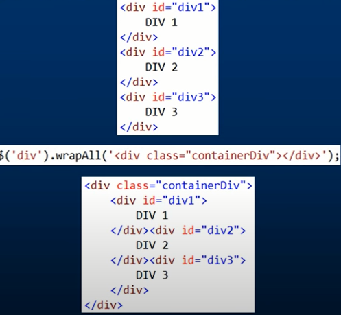

# JQuery

Nots:  

* there is two type of object load in the jquery

1. $(document).load : trigger when the html element load
2. $(window).load : trigger when all page is fully loaded (html ,css ,js ,images) element load

* the selector in raw js vs JQuery

selector by |js|jQuery
---|----|-----
id|document.getElementById("main");|$("#main");
class|document.getElementsByName("chName");| $(".rowToToggle")
name |document.getElementsByClassName(names); |$("input[name='myCheckBox']")
tag name|document.getElementsByClassTagName(names); |$('div') or $('div a') or $('div, a, h1')  

* to loop over the item we use ().each() with the selector that mean like **Foreach**

* we can insert element before and after any element we want using " **insertBefore** ,**insert** ,**after**,**insertAfter**" and also we can wrap the element with any element we want using " **wrap** **wrapAll** **warpInner** **unwrap**" Like : 

* if we want to update the DOM in loop the best approach to update it once after save all changes  
* **[All Selectors](https://api.jquery.com/category/selectors/)**  

----
.png)
