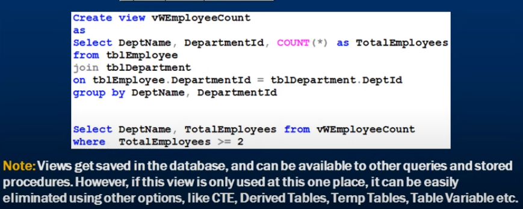
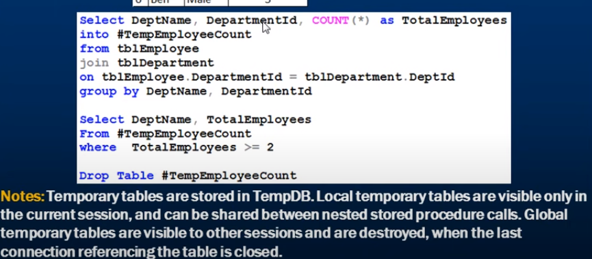
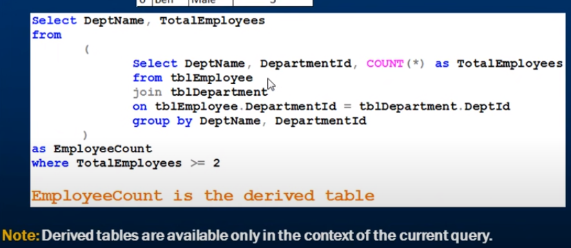
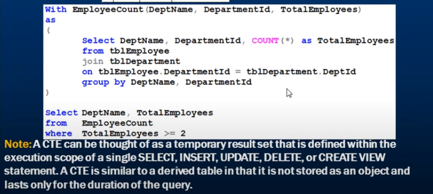

# SQL tutorial

| Section  | Link   |
| -------- | ---------------- |
| IMPORTANT Notes | [Link](#important-notes) |
| Notes | [Link](#notes) |
| DISTINCT /GROUP BY | [Link](#distinct-group-by) |
| SQL aggregation Functions | [Link](#sql-aggregation-functions) |
| operators in the where | [Link](#operators-in-the-where) |
| ways to create derived tables | [Link](#ways-to-create-derived-tables) |
| join in sql | [Link](#join-in-sql) |
| way to replace null | [Link](#way-to-replace-null) |

## IMPORTANT notes

| num   | Note                                    |
|------------|------------------------------------------------|
| 1| if we use `group by` we should put in it all column in the select part |

## notes

| num   | Note                                    |
|------------|------------------------------------------------|
| 1| in (sql server) to limit the result we use `TOP 1 or TOP 15`, in (MySQL, PostgreSQL, SQLite) we use `LIMIT 2 or LIMIT 100` |
|2| in most time we use Row_number as this `ROW_NUMBER() OVER (ORDER BY column1) AS RowNum`  |
|2| **Over** in sqlServer is use just with 5 function (**ROW_NUMBER()**, DENSE_RANK(), RANK(), NTILE(4), LAG(column1))|
|2| we can use **PARTITION BY** to make counter is unique for each group `ROW_NUMBER() over(PARTITION BY Users.[Password] order by Users.[Password])` like [image](PARTITIONBY_in_ROW_NUMBER().png)|

## DISTINCT /GROUP BY

In SQL, both the DISTINCT keyword and the GROUP BY clause are used to retrieve unique values from a result set, but they function differently.
DISTINCT: The DISTINCT keyword is used to eliminate duplicate rows from the result set.
GROUP BY: The GROUP BY clause is used to group rows based on one or more columns. It is typically used in combination with aggregate functions like SUM, COUNT... etc

``` sql
SELECT DISTINCT column1, column2
FROM table;

SELECT column1, SUM(column2)
FROM table
GROUP BY column1;
```

## SQL aggregation Functions

COUNT(), MAX(), MIN(), SUM(), AVG()

## Operators in The WHERE

| Operator   | Description                                    |
|------------|------------------------------------------------|
| =          | Equal to                                       |
| <> or !=   | Not equal to                                   |
| <          | Less than                                      |
| >          | Greater than                                   |
| <=         | Less than or equal to                          |
| >=         | Greater than or equal to                       |
| BETWEEN    | Between a range of values                      |
| LIKE       | Pattern matching using wildcards               |
| IN         | Matches any values in a list or subquery        |
| NOT IN     | Does not match any values in a list or subquery |
| IS NULL    | Checks for a NULL value                         |
| IS NOT NULL| Checks for a non-NULL value                     |
| AND        | Logical AND operator                            |
| OR         | Logical OR operator                             |
| NOT        | Logical NOT operator                            |

## ways to create Derived Tables

there are many ways to derived a Table

1. **view**


2. **temp Tables**


3. **Derived Table**


4. **common table expression (CTE)**


## Join in sql

The type of join in sql Server

1. Inner Join: Retrieves records that have matching values in both tables being joined. It returns only the rows where the join condition is true.

2. Outer Join

    * Left Join (or Left Outer Join).

    * Right Join (or Right Outer Join).

    * Full Join (or Full Outer Join).

3. Cross Join (or Cartesian Join): **not important**

* Self Join: Joins a table with itself,and its not a new type of join it can be inner or outer or cross join,for example (manager and employees both of them is form user table)

## way to replace null

In SQL Server, there are multiple ways to replace NULL values with a desired alternative.

1. COAL ESC E Function:

   ```sql
   SELECT COALESCE(column_name, 'replacement_value') AS column_alias
   FROM your_table;
   ```

2. ISNULL Function:

   ```sql
   SELECT ISNULL(column_name, 'replacement_value') AS column_alias
   FROM your_table;
   ```

3. NULLIF Function:

   ```sql
   SELECT NULLIF(column_name, 'value_to_replace') AS column_alias
   FROM your_table;
   ```

4. CASE statement:

   ```sql
   SELECT 
       CASE
           WHEN column_name IS NULL THEN 'replacement_value'
           ELSE column_name
       END AS column_alias
   FROM your_table;
   ```
