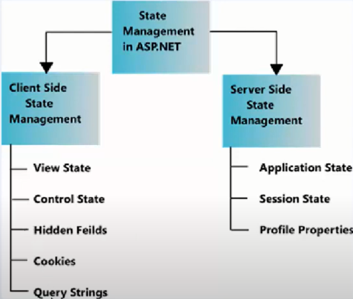

# Web Forms

## Standards and General Information

1. When you have any type of view, you can search for it in two places:
   1. In the view page (aspx file) by its name or type of form in the view section.
   2. From the code (aspx.cs file) by searching for its event using the view item name as a standard. [Standard 1](./web%20forms.md#standard_1).

### Standard 1

Event names for the view should follow the format: viewName_eventName (e.g., btnSave_Click).

## Storing Data in Web Forms

1. View State: The view state is a hidden field in the HTML page that stores the state of the page and its controls in a serialized format. In simple words, it allows the data on the page to remain "sticky" when we reload the page. However, keep in mind that view state is a hidden field, and storing a large amount of data can increase the size of the page, impacting performance and making it slower.

2. Session: Session is another way to store data on the server-side, similar to view state. The main difference is the scope and lifetime of the data they store:
   - Session: A session is a server-side mechanism for storing user-specific data, such as a user's preferences or login status, for the duration of the user's visit to the website. The data is stored on the server and is accessible to all pages within the website. The data is stored in memory and is lost when the user closes their browser or the session times out.
   - View State: View state is a mechanism for storing the state of a web page and its controls between postbacks. View state is a hidden field in the HTML page that stores the state of the page and its controls in a serialized format. The view state is sent back to the server with each postback, allowing the server to restore the state of the page and its controls to their previous state. View state is specific to a single web page and is not accessible to other pages on the website. In summary, session is used for storing user-specific data for the duration of the user's visit, while view state is used for storing the state of a single web page between postbacks. Both mechanisms can be used to store state information, and the appropriate choice depends on the specific requirements of the application.

1. ViewState:
   - It is used to preserve and maintain the state of elements and controls on a specific web page.
   - It is stored as hidden data on the page and is sent with each request from the page.
   - It is tied to the user's session and is temporary for that session only.
   - It is used to retain control data in case of postbacks.

2. SessionState:
   - It is used to store and maintain data across different user sessions.
   - It is stored on the server and is associated with each user through a unique Session ID.
   - It can be used to store data needed by session variables across different pages in the application.
   - It is deleted when the user's session ends or after a specified inactive time period.

3. ApplicationState:
   - It is used to store and maintain data shared among all users in the application.
   - It is stored at the application level and is accessible to all users and pages in the application.
   - It can be used to store general and shared data such as global settings and information shared among users.

|              | ViewState                               | SessionState                          | ApplicationState                   |
|--------------|----------------------------------------|---------------------------------------|-----------------------------------|
| Purpose      | Stores and maintains state of controls | Stores and maintains user-specific    | Stores and maintains application-wide

 |
|              | within a specific web page             | data across multiple pages            | data accessible to all users       |
| Storage      | Hidden field on the web page            | Server-side storage                   | Server-side storage                |
| Scope        | Single page                             | Single user's session                 | All users and pages                |
| Lifetime     | Temporary, for a single session         | Persists until session expires        | Persists until application restarts|
| Accessibility| Only accessible within the same page    | Accessible across pages within a user | Accessible across all pages and users|
| Usage        | Used for postback and control state     | Used for maintaining user-specific    | Used for application-wide data     |
|              |                                        | data (e.g., user preferences)         | (e.g., global settings)            |

## ASP Tags vs Basic HTML Tags

In ASP.NET Web Forms, "asp:" tags like asp:TextBox are server-side controls, while the input type="text" tag is a basic HTML input element.

The main difference between the two is that the asp:TextBox control provides additional functionality and features not available with the basic HTML input element. For example:

1. asp:TextBox can be easily accessed and manipulated in the code-behind, allowing you to programmatically set its properties, such as text, font, and color.

2. asp:TextBox can automatically maintain its state across postbacks, meaning that the value entered by the user will be preserved even if the page is reloaded.

3. asp:TextBox can be easily styled using CSS or customized using the built-in ASP.NET validation controls.

## images

