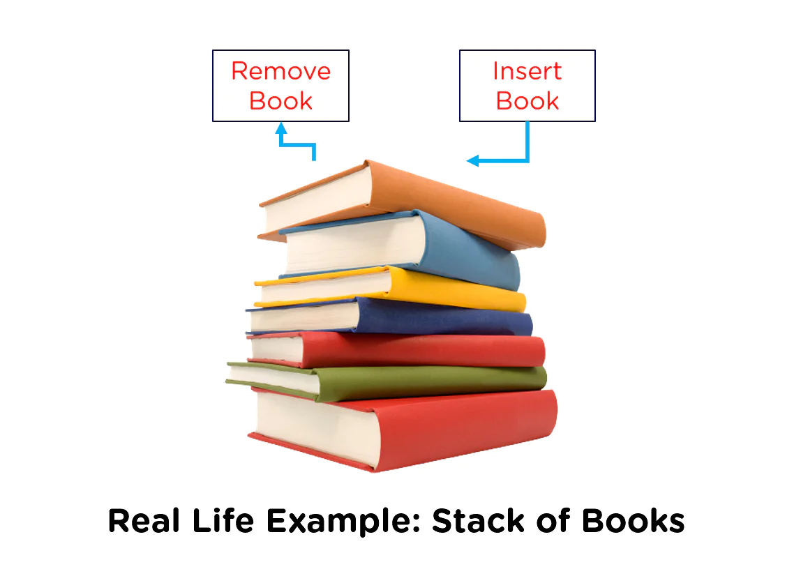

# Stack & Queue

so today we take Stack and Queue and how to create a white bored with it.

## Stacks

---

the first thing is that the stack means a linked list in a specific condition that makes us deal with the top node just `FILO`.

like in real life when we get a stack of books sorted above each other if we want to add a book to this books we add it above the other and if we need any book we need to remove it from the top book by book `add and remove from top`.  
  

and we take about four method we use it with Stacks

   - Method `push` to add element in the stack.
   - Method `pop` to return and remove from the stack.
   - Method `peek` to return the value of the top of the stack **first element**.
   - Method `isEmpty` to check if the Stack is null or not.
    

## Queue

----

then we take about another thing that the queue and his specific condition that make us add in last and take from first `FIFO`.

like in real life when we take about the line of waiting people in any market or games .... , that the first people in line take the first place for shopping playing `out the first from the line`.  
     

and we take about four method we use it with queue

- Method `enqueue` to add an element at the first of Queue.
- Method `dequeue` to remove the last element in the Queue.
- Method `peek` to return the value of the rear of the Queue **Last element**.
- Method `isEmpty` to check if the Queue is null or not.

