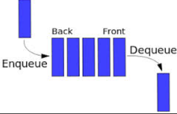

# Stack & Queue

Stack And Queue are a containers that we use it to store data in specific way and the special of this way is that the time comblexcity is `O(1)`.

## Stack

Stack it is a series of node like linked list but under condtions for add and remeve that we call this way **FILO** `First In Last Out` .

this `FILO` is take about some rulse
- you cant add any waer you need to add at top just.
- you can remove from top element just.  

## queue

as stack, queue it is a series of node like linked list but under condtions for add and remeve but that way is deferant we call hhis way **FIFO** `First In First Out`.

this `FIFO` is take about ather rulse
- you cant add any waer you need to add at last just.
- you can remove and take elemnt from first just.  

------

## [LearningJournal](./LearningJournal.md)