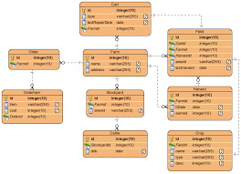
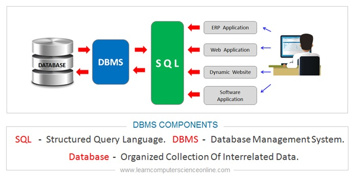

# ERDs :bar_chart:

ERD: it is a blueprint or a design describing all the tables and the relation between the table for making our data model, and it is one of the first step to create our program and database. 
Example of ERD:
    
**Data modeling**: is a design of a framework have what data and the relations between it in the database should look like and provide the structure of the database.  

**Primary Key**: a unique value never change and exist in all data row use to create to identify the data from each other.

and when we use ths `primary key` for grope of data (table) in another table we name this primary key **`Foreign Key`**.
and when we create a key from two files and usually that two fields is the primary key and the foreign key we call that combination **`Composite Key`**.

NOTE :scroll: :  
```
having a primary Key in all tables even if we dont need it is useful, in this way we make our database is more reusable and our model is more flexible if we want to update our program. 
```

**schema** : the schema in database is somthing that till us how data organized.


**DBMS**: is a software Like (`mySQL` `oracle` `postgreSQL` `microsoft SQL server` ) used to create and manage `data` and `databases`.

we use to deal with databases and create statements in the programs or any systems language that can work with most DBMS system it called `SQL` (Structured Query Language ).





**data**: it is all the fact, element, image or anything that can be recorded, and it is the most important thing in any DBMS.

**database**: is a collection of data the organize, sort and store in places that we can access what ever we want under some conditions from a DBMS  

**relationships**: in any data model or database the data tables it is not stand separate all relate to each other and that what we called  `relationship`, and this relation between tables has many types.

1. **1:1 Relationship**: in this relation each row of the first table connect with one row of the second table.

    Example: each company has one CEO (1:1). 

2. **many:many Relationship**: in this relation more than one row from the first table connects with more than one row from the second table.

    Example : teachers teach students (m:n)
3. **1 : many Relationship**: in this relation each row of the first table connect with more than one row from the second table.

    Example: person an have many cars.

**CRUD**: it is a shortcut for Create Read Update Delete 

-------

**[LearningJournal](./LearningJournal.md)**