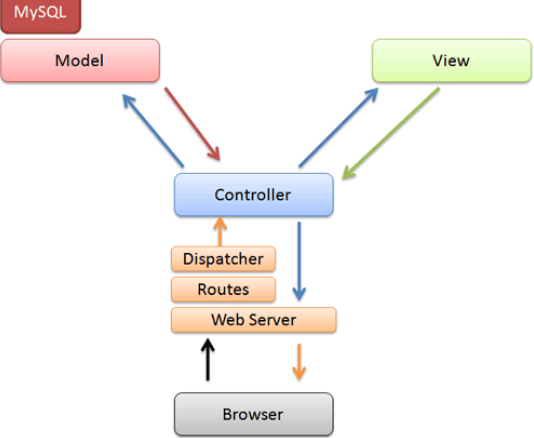
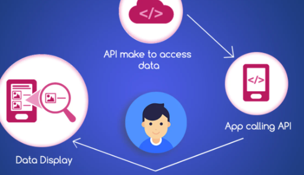

# Entity Framework Core

so from today we going to use Entity Framework Core a cross platform for our code and that is some different from `dotNet framewrok`.

in this part we will use ASP.NET Core from this we can start with a template for any ASP.net core like `MVC web app` `API` `Angular` ... etc.

what we will start with is the ASP.NET Core web app (MVC) and from this we will find a three folders created with our program class `Model` `view` `controller` and we will learn about how to start thinking for code in this way.

1. Model : here is what we will create and connect for the database and in this way making dealing with data is easier because we deal with classes so we can use `query & LINQ`.

and when we talking about the Model we going to take about `Data Seeding` or how we can enter data to our program.

2. view: here after we receive data we create a template in something named `Razor markup` to return it to the client.

3. controller: here we manage the whole process in `MVC` form choosing the correct model, send it to view until return it to the server. 

## Intro to APIs

API: a library or just some code transfer data with HTTP `json` or `xml` and in this way we can use it all over the internet.

then when we take about HTTP we have a stander build in method to access the resourses we call it `CRUD`(Create-Read-update-delete) or with this method names (Post-Get-updata-Delete).

for evry resorce access there are a **status code** to tel the user what habend the this response like :

- `200` meaning that is OK.
- `201` meaning that is OK and you create a new resurce.
- `400` meaning that is NOT ok client do somting wronge.  
- `404` meaning that resurce Not there or URI is wronge.
- `401` meaning that you dont have the athintction to retch the resurce.
- `500` meaning that somthing wronge in the server.

