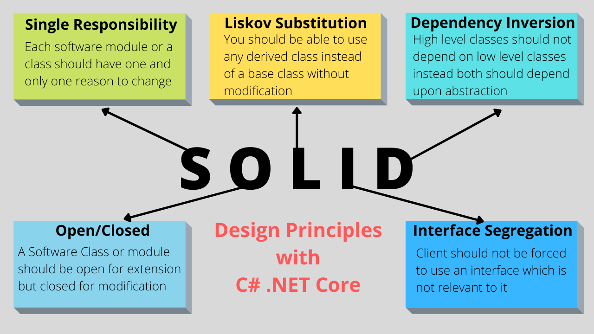

# dependency injection   :syringe:	 	
**dependency injection**: it is way to get data from another class object like :
```
Animal animal = new Animal(); 
``` 
but we use it in way that we send ( injection ) object in another, in this way the code will be more reusable and easy to edit and maintain. 

We can use dependency injection in three methods depending on case we use it 

- AddSingleton() : it creates the injection the first time requested just and still on all the project lifetime. 
- AddTransient() : it creates the injection in each time request serves.
- AddScoped() : it creates one injection for all calls in the same request.

## Repository pattern  :bar_chart:


with dependency injection we usually use another way to deal with classes called `Repository pattern` in this way we dont add the class that we want to use it direct we use (semilar to dependency injection) an interface Repository and emplemnt this interface in classes and in this way we can change the class from one time and no need to edit all the places that we use this class with in this way our project will be more reusable and easy to edit and maintain. 


## SOLID Principles  :scroll:


this name is a shortcut for five Principles you can find it [here](https://medium.com/backticks-tildes/the-s-o-l-i-d-principles-in-pictures-b34ce2f1e898).

but the main idea for using these Principles is to make our code more flexible and prevent errors and when we build our code depending on it we prevent duplicate code , fixing errors will make fewer other errors and much more.



