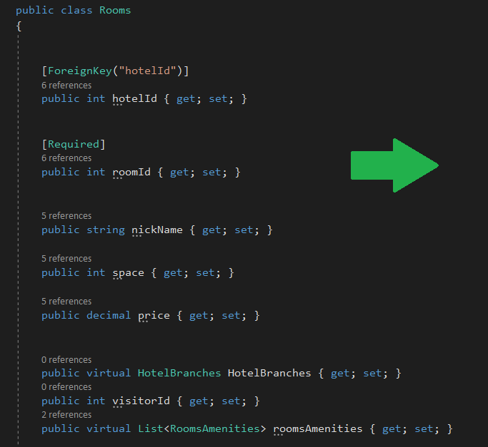
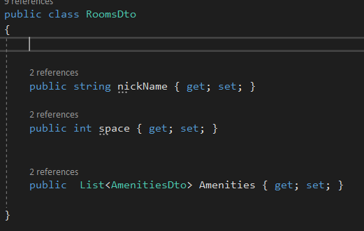
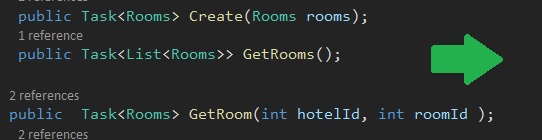
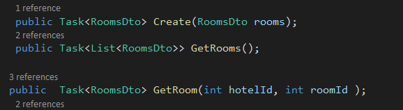

# DTO 
the DTO is a class we create to customize Data that we get from the model that take contact with the database `controller <- DTO <- model <- database`.
in this way we have to benefit
- add more security to data in the database.
- customize the returned JSON data to be have just what we want.
- make JSON more readable.

so the right way to use DTO is
1. build class has prosperity that we want from the model for example :

as you see we have the only field that we want, and we in the DTO class we remove the navigation property and the annotation because it is a normal class not class have a connection with the database.

then we change the return class in `Get` `GetAll` `Update` and the property in the `Post` ,`Update` to from
1. controller.
2. interface.
3. service.
to be from classDto type.

then we need to edit code in the server and (the controller if we need) to work with the new response.

you can find Demo [here.](https://github.com/fuad-bassam/Async-Inn)

