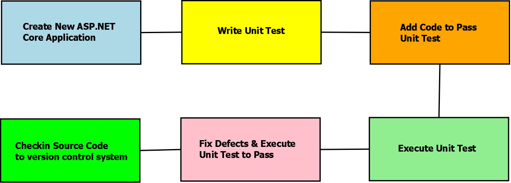

# Testing API and Swagger 

`OpenAPI` : it is a document that show what the API can do and describe it.

`Swagger`: is the tool that uses the OpenAPI.

in DotNet core we can use Swagger in two main tools `Swashbuckle`, `NSwag` we find adding some of it from NuGet Packages.

## Swashbuckle

**Swashbuckle** is very helpful Package for documenting and saving time.

We can create this from [this document.](https://docs.microsoft.com/en-us/aspnet/core/tutorials/getting-started-with-swashbuckle?view=aspnetcore-5.0&tabs=visual-studio)

if we want to show the user our API document with a colorful page have all that we want in the APIs we can use from swashbuckle the `Swagger UI`.

we can specify whatever we want a put the API in it like

- describe for API.
- button to check the real data in the database. 
- example of the data schema.
- the response code and distribution for everyone.

  
----
## Testing API

in this part we use the Testing unit as we use it before but in this time we use it for controllers to test controller behavior.

Testing controller we test the action without the interactions component like `models`.

and here we can test groups respond to a request.

and we can have a group of test controllers **[here.](https://docs.microsoft.com/en-us/aspnet/core/mvc/controllers/testing?view=aspnetcore-2.1)** 

  