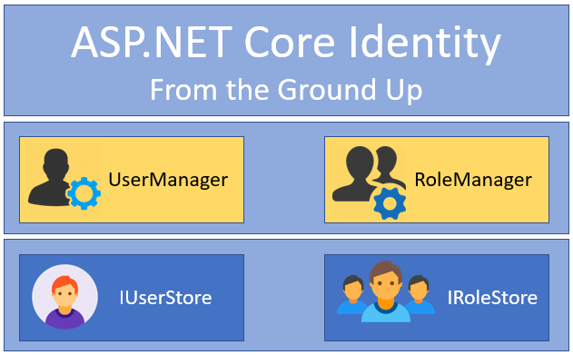

# Identity
Identity is a library that we use in ASB.net core for users and authentication. 

Use in :
- user account.
- accounting confirmation.
- authentication. 
- authentication with sms.



And to use identity this we follow some steps :
1. Replies the inherent from the database class from 'DBContext' = 'identityDBContext'.
2. Then we implement inside the `startup.cs` ->  `services` the identity.
```
services.AddIdentity<AddIdentity<ApplicationUser, IdentityRole>()
                .AddEntityFrameworkStores<ApplicationDbContext>();
                
```
3. then in the same class `startup.cs` -> `Configure` then before `services.AddMvc();` method we add method for the authentication
```
app.UseAuthentication();
```
4. then we go to `data class` => `OnModelCreating` we add 
```
base.OnModelCreating(modelBuilder);
```
5. last thing we add the `add migration` then `update database`

