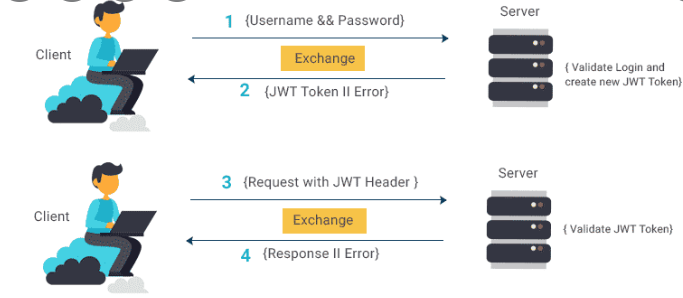
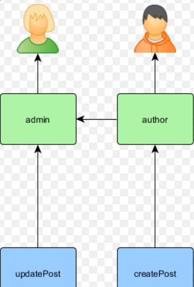

# Tokens 💰
Tokens like a key or coin it with server make it and can trust it give it for the user after they singe the first time and the client store them, in this way make the authorization more flexible and the user dont need to send his user data every time they want to do anything.


  

## Authorization 👐
os in this part if we want to control the access in the controllers we need to add `[Authorize]` we can add in the controller level or the methods, after we add this we tell the program that at lest need to login to have the access, and we can put some exceptions for that by adding `[AllowAnonymous]`

  

## Roles 📜

Roles are working authorization to detect the access for each user and what they can do in these roles.

and to implement claims-based authorization we have two steps : 
1. Create Claims policies like :
```
 services.AddAuthorization ( options = > 
        { options.AddPolicy ( " DeleteRolePolicy " ,
                 policy = > policy . RequireClaim ( " Role 1" ) ) ; } ) ; 
 ```
 
 2. Use the Policy for Authorization Checks like:
 ```
  [ HttpPost ] 
  [Authorize ( Policy = " DeleteRolePolicy " ) ]
   public async Task IActionResult > DeleteRole ( string id ) { 
       // Role code 
        }
```
