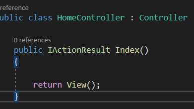
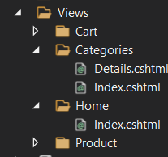

## View

so in the MVC the `View` is one of the parts that make the page (razor page) from the data that return from the model and the man relation in the view with the Controller 
also, the view pages is pages with extinction `cshtml` that mean (C sharp HTML) an HTML page can we wright c# code in it and that makes it more dynamic than the stander HTML pages

so one way to use the View in the MVC controllers by sending the action to the view it do that we need
1- in the controller send the method with the param data if it exists to the view 

2- we need to create a folder for the View and inside this folder we need to navigate the method for `Controller name as folder then `the method`

we can pass the data in the view in three ways
1-Veiw data `ViewData["Key"]= data`
2-View bag `ViewBag.PageTitel = data`
3- stromgly typed view `@Model.Data`

**EXTRA**
we can Customize the path for the view py sending the other path as sting like
**View()** -> if in the same folder **View("name of the other view")** if in another folder **View("path/("viewName")**   
**View(object)** -> if in the same folder **View("name of the other view",object)** if in another folder **View("path/("viewName,object")**

## Forms

there are many ways to add forms in our project 
1. by creating it directly from the View to the method one by one 
2. by creating holder (bag) that stores the data from the View
3. and also there is ways using AJAX that will take about it in the future 

----------------------
**[Learning Journal](./LearningJournal.md)**

 

