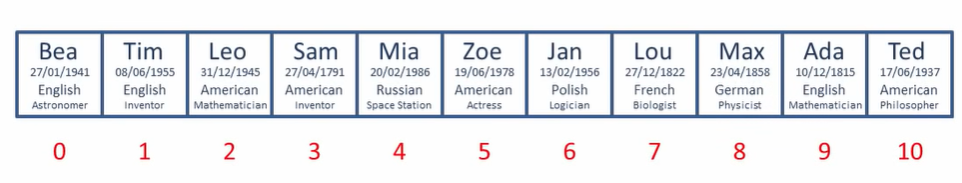
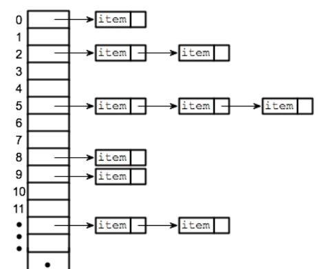

# hash Tables 
it is a table (similar to  array) for key-value pair that use to store the data, and one thing that makes it common is the fast it to retrieve the data no mater how much data we have 

if the hash tables build in the wrong way to can have `O(n)` but in reality it is `O(1)`

some places that we use hash data and hash Tables 
1. data indexing
2. chaching
3. error checking 
 

if two value have the same key it is called `Collision` and one of the way to solve it is `chaining` in this way we make the data with the same key that store them in a linked list in order
 
 