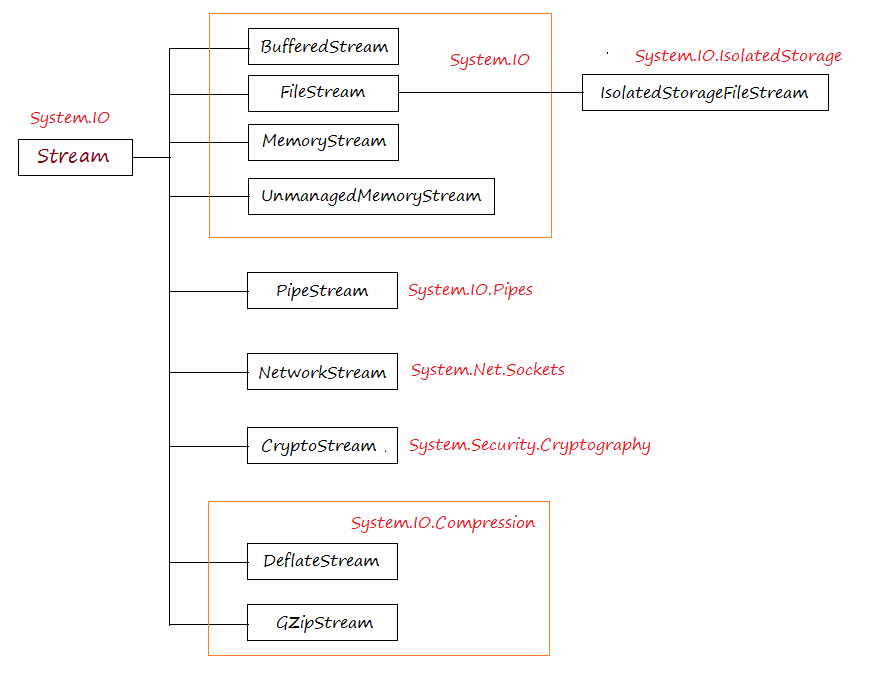

# File and Stream I/O

first of all I/O stream it is the way that computers can handle (input/output) items and this is his response to (read /write) data even from disk
-----

## System.IO

in `.Net` System.IO is a library content commands that let us interact with files and directories and a lot of different ways and reading and writing in files and data.

`Directory`: this response to retch Directory and Files and do some proses on it .

`DirectoryInfo` : that method allows us to get specific directory in our program.

Example :
``DirectoryInfo anyName = new DirectoryInfo("theBathForDirectory")``

if i want to use the path for my Progarm directory we use ` (" . ") `  
if i want to use the path for any directory we use ` @ ` at the first and then the locaition for directory  ` (@"C:\Users\fman\file1") ` 

`File` : that method allows us to use files in program.

write a file : ` File.writeAllLines( path, whatIWantWrite ) `

---

`Streams` : this response for transferring data from our program and files.

`FileStream` : to read data file.

`FileStream anyName = File.AnyCommand"OpenRead ,Create ,Open"(path)`

-----
`Asynchronous I/O operations` :this represents asynchronously and synchronously that we use when the project needs to connected to data in continues way when the project is running and manage this connection to prevent the program from crashing.

---

`Compression` : System.IO.Compression has ways to reduce the size of data and deal with this compressed data.

----

