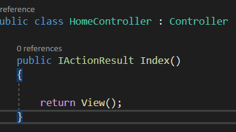
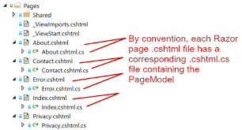
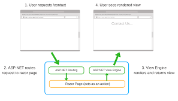

# Razor Page
Razor Page in a simple way it is a platform is used to create a cross-platform web pages,
we need Razor Page because it is the easy and organized way with framework that helps you to build a dynamic web page 

## Advantages of Razor Page
1. easy to learn 
2. it supports cross-platform
3. lightweight and flexible
4. organized with code-behind page 

so what we use before to show the data in `view` it called Razor Page and we can do c# command with HTML tags at the same time that with make it simple and flexible to work with

so one way to use the Razor Page in the  by sending the action to the view it do that we need
1- in the sender method with the param data if it exists to the view 

2- we need to create a folder for the View (Razor Page) and inside this folder we need to navigate the method 

we can pass the data in the view in three ways
1-Veiw data `ViewData["Key"]= data`
2-View bag `ViewBag.PageTitel = data`
3- stromgly typed view `@Model.Data`

 ----------------------
**[Learning Journal](./LearningJournal.md)**
