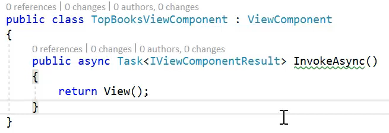
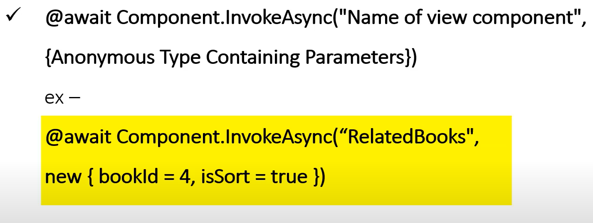
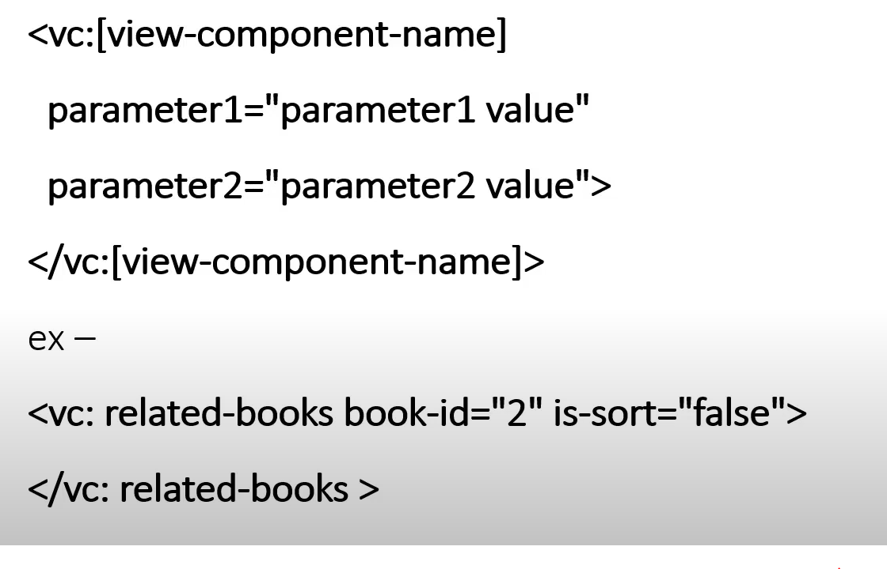

# View Components:
View Components is a view like part of view but it don't use model binding but takes the data from the method that call it and deal with this data without being part of HTTP request.

We can use to build and view that need to return data without be part o the request like:

1. get table data from the database on the first page

2. in the cart for online shop

3. display data from the user that login or on his rolls or claims

## To use View Components

To use View Components we have some steps 
1. create class and we recommended to end the name with `NameViewComponents` in this way that make it the default for the view page 
2. this class should inherit from `: ViewComponents`
3. create the method that we want to do **HENT** the return type is `IViewComponentsResult`

4. after creating the method and do some database and logic we need to create a view page file, for that we go to `View` then to create folder that has the same name with ViewComponents name we can create it on the to level or in the `Shared` folder
5. then in this location we create the `cshtml file` (razor view) and add the component and tags on it 

6. implement this view Components in our code in one of two ways:   
   **OR**

 ----------------------
**[Learning Journal](./LearningJournal.md)**

