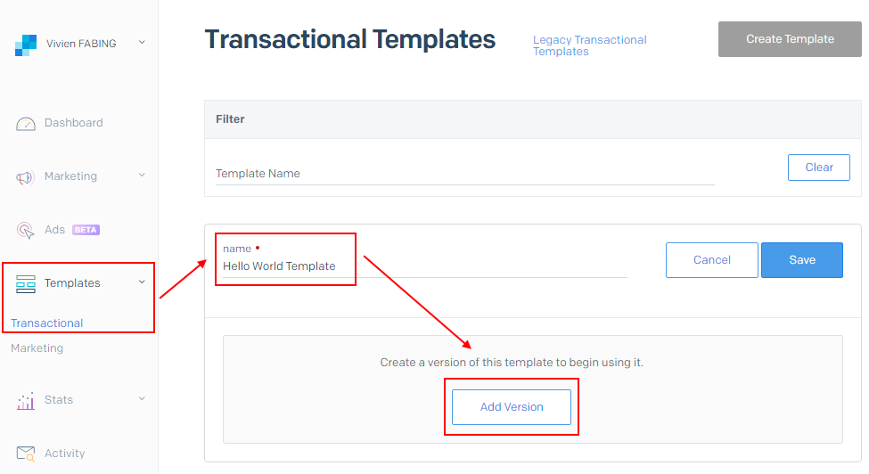

# Sendgrid
Sendgrid is an email provider that makes you to send emails **without** having email servers that deal with the details for the process

The benefit of using sendgrid nested than MailKit that sendgrid is do all preparing in `STMP`.

To send email using sendgrid we have to:
1. Create an account in sendgrid website
2.  Take the API key and add a in our project
3.  Install SendGrid NuGet package
4.  Add SendGrid API key and user settings to appsettings.json 
5.  Create a service to use SendGrid
6.  Make the Index razor page  call SendGrid service in it 

And we can find more information about it **[here](https://sendgrid.com/resource/setting-up-your-email-infrastructure-with-twilio-sendgrid/)**

 ----------------------
**[Learning Journal](./LearningJournal.md)**
