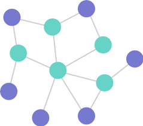

# Graphs
Graphs is a data structure that represents a group of nodes that connected with each other 

so also we can divide the graph depending on 
1. the way that nodes connect with each other or the way that edges drow to
 - Undirected Graph: that the edge has on arow and the is the number of node +1
 - Directed Graphs `Digraph`: that have arow to tell the node that any way between to node can take
2. also in the way that node are connected depend of the connection in all graph to
- Complete: that all nodes connected with all nodes
- Connected: that all nodes connected at list with one edge with each other
- Disconnected: that there is some part of the graph is not connected
3. with the loops in the graph to
 - Acyclic: that there is a dividend in some node
 - Cyclic: that there is a part of the graph is an infite loop

 Graphs is used a lot in life:
- GPS
- Driving Directions
- Airline Traffic
- etc
 
