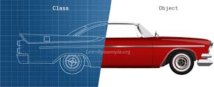
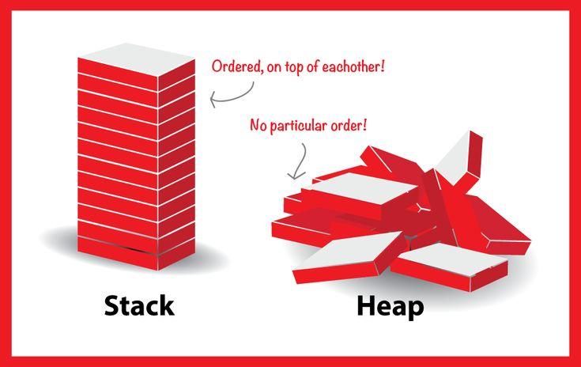

# classes
----

 


classes is the templet (blueprint) for creating element eath element have the same probaritys with defernt value called `Opject`.

and the classes can take atrepeute from another classes and that what we calld `inheritance`.

this `Opject` is a instance of Class have his own data but in his Calss format , we can creat opject form class in `Reference way`.
 
this `Reference Type` is the way that we told the compilor that this Opject have the templet for spasifc class .

`ClassName object = new ClassName();`


so if we want to creat an object we need to give evry object data mostly not like the other object and in class there is a method that do this assign this data called `Constructor` and this constructors method must have the same name of the class and have the atrepute that it will assign it .
Example

```
public class Class1
{
    string attribute1;
    string attribute2;

   public Class1(string attribute11, string attribute22)
   {
      attribute1 = attribute11;
      attribute2 = attribute21;
   }
```
and also for constructor there is aonther type it will work fast and get called first and most use for static property for make default data called `Static Constructor`, but this Constructor shouldn't have parameters, we call each parameter with separit `setter` and `getter`.
this  `setter` and `getter` way way it is more secure and the data can reath in the better way we call it `Properties`.

Example
```
public double FirstName
   {
       get { return _firstName ; }
       set {
          _firstName = value ;}
   }
```
 **Hint:-**

  -  we start `firstName` with `_` and we use `camel case` that way programer use to say that is a privte cant accesses from out  of class.
  - we use FirstName to reach the privet proparity  _firstName and progrmer use `pascal case` to write it.
  - `value` is the way that `set` have the data ` ClassName.FirstName = "fuad";` the `value` have **fuad** to but in setter.


**Auto-implemented properties.**
```
   public string Name{ get; set; }

```

## Stack vs Heap
----  

`stack`: we use it for store local variables, and we push and pop data in stack Last data in First data Out `LIFO`and when the scupe is done the stake will release.
`Heap`: we use it for store reference variables, Class instances (opject) and strings.
and when the contion is null `Garbage Collection` **(GC)** will empty the Heap. 


------