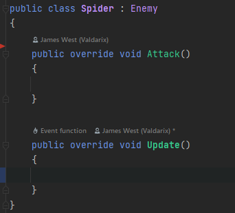
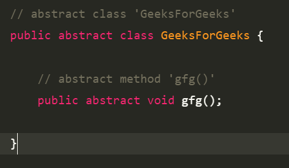
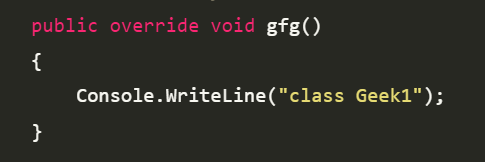

# how we can use OOP Principles in code

1. if we need to create a number of data and functions that have the same field you need to create an element `object` from blueprint `Class`.
2. Class have to part variable and method and have 3 types:
    - normal class.
    - [Inherit class](#Inherit-class) (**base** OR **child**).
    - [abstract class.](#abstract-class)
3. in the Encapsulation part there are three access modifiers 
    - Public - all can edit on it.
    - Private - Only the class itself can edit it.
    - Protected - the class and his inherent class `child` can edit on it.

4. Polymorphism is like Overread and overwrite but can do much more else like assign chile class to base class if we want to use this method on all the child from this base class.

### Inherit Class
---

in this class we have two types of class the first one have the data and method that we want to use in his object and another object we call it `base`
and the other one that gets the data from base class we call it `child`.
    
### Abstract Class
---

in this class we cant create object from there but can create other class (it is a class to make other classes) and to what we should have in class.

    
  **override_class**
    