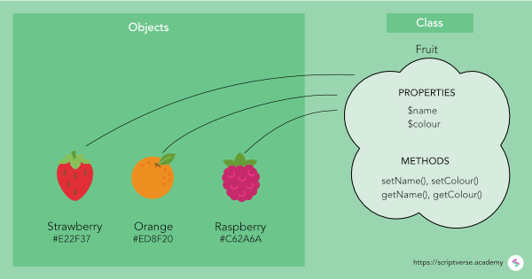
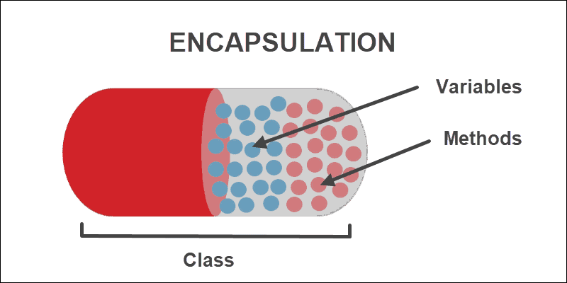
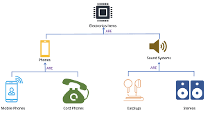
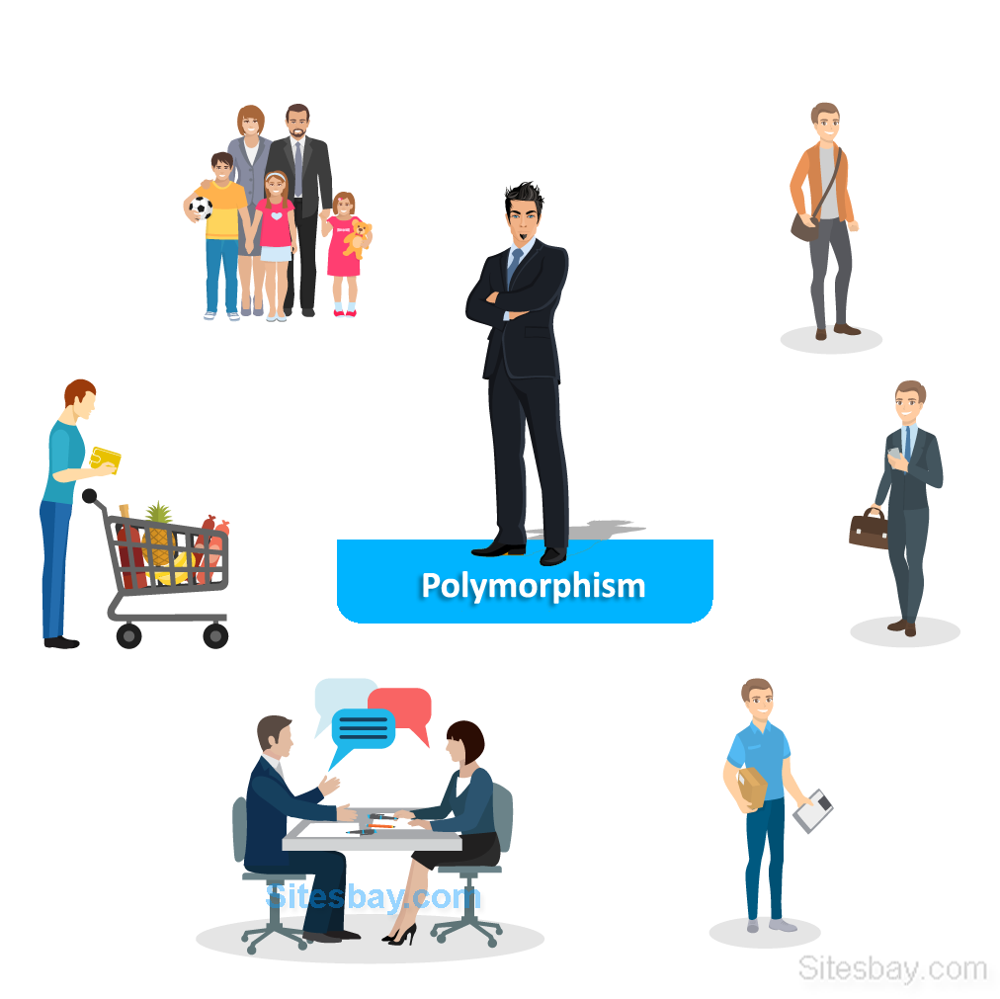

# Object Oriented Principles
defore we take about Object Oriented Principles let us know what it is

`Object Oriented`: coding model that we organize code and data in it depend on some rules ar principles .

**OOP principle**
- [Abstraction](#abstraction)
- [Encapsulation](#encapsulation)
- [Inheritance](#inheritance)
- [Polymorphism](#polymorphism)

## Abstraction   
Abstraction is to make evry thing about object is clear by told told the program what the values in this object (`porperites`) and what can do (`methods`) by creating a blueprint for all the object form the same type and that what we call it `Class` and his `constractor`. 

## Encapsulation  

Encapsulation is to hide data and the code in this way the programmer didnt have to know how the class work all what he need to know is what the atripute that they want and to know what the method or the code do . 

## Inheritance  

Inheritance is in a Class take the atripute and method for anther class, in this way if a blueprint (**Class**) need to have the same data and method for another blueprint and some extra data and method we dont need to creat object from zero we can Inherit object.

## Polymorphism

Polymorphism is to the Class can implement his method rather than his inherited Class, that mean supClass can rewrite (**overwrite**) the method in this way even if it take the methods from another Class.

