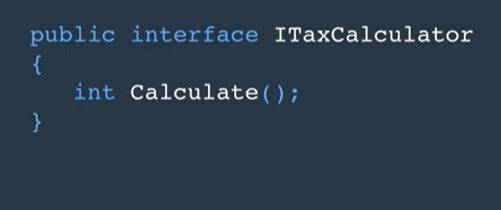

# Interface
The interFace is like a method class that i can use in several classes.

The reason for use interface is to make a class and his componant (variable and method) is not totaly related to each other and in this way we can eazy replace it or use other feachers .

in interface we declear but not implementing the impleminting happend in the class that inherent that interface
one of the peneft is i can use many interface `in the same class` unlike normal inhert ,the name of and interface all programer start the name with `I` .

   

-----

## We use this power of code in abstract class and there is much similarity between both but also it bot the same

**Abstract Class**|**Interface**
-----|-------
can implement some of member|cant implement any thing
have access modifiers|it is allwse public
can inhert from any thing|can inhert from just interface
can inhert from and for one thing|can inhert many interface in the same class