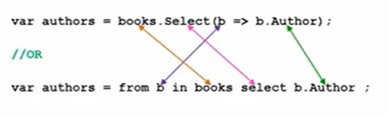

# LINQ 

it is a that technologies give c# ability to deal with query syntac.
**LINQ spport**
 - objects
 - entities
 - XML
 - dataset

## LINQ write
we can write LINQ in 
- method base

```
Exampe :
 dataType numQuery2 = numbers
                        .Where(`...condition...`)
                            .OrderBy(`...condition...`)
                            .select(`...condition...`);
```

the condetion in this way need to be writen with `lamtha` exepriten (**b => b.FirstName**).
- query base
```
Exampe :
dataType scoreQuery =
               from n in numbers
                 where ...condition...
                 select ...condition...;
```



---
Most command we use  

1. WHERE 
Used for filtering the requer data from all the data.

```
Exampe:
var cheapBooks = books. Where (b => b. Price < 100); 
```

2. ORDERBY 

Used for ordering the data based on some comditions.

```
Exampe:
var booksCostWise = books.OrderBy (b => b. Price)
```

3. SELECT
Used for selecting property out of an objects or other data.

```
Exampe:
var authors = books. Select (b => b.Author);
```
