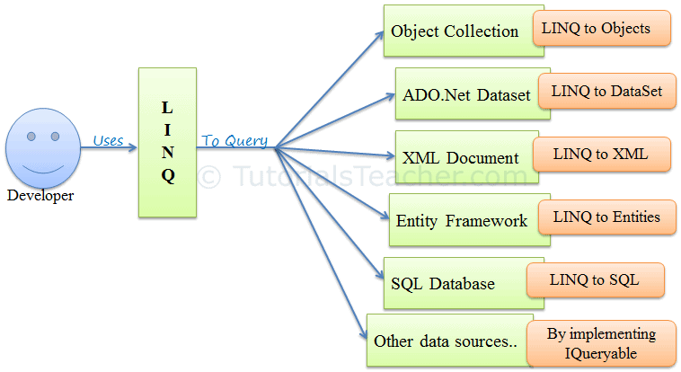

# LINQ
So we should take today about LINQ **Language Integrated Query** and what it is . it is way give in c# give us ability to deal with query syntac.

and in C# and dotNet we can write it in two way as `methods syntac` and `query syntac` in both way LINQ have many commands in it and the most used commands is 

- WHERE :  Used for filtering the requer data from all the data.
- ORDERBY :  Used for ordering the data based on some comditions.
- SELECT :  Used for selecting property out of an objects or other data

and we use it in many places like :

