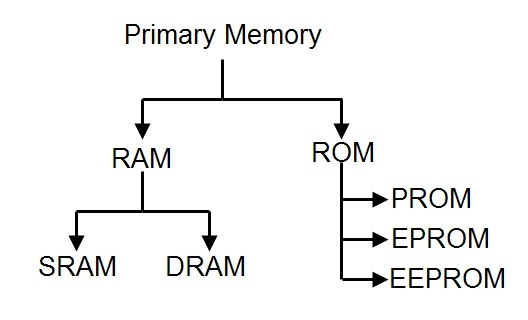

## Terms

Title|Stand for
------|-----
DMA|Direct memory access
UNIV-AC|Universal Automatic Computer
OCR|Optical character recognition
OMR|Optical mark recognition
MICR|Magnetic Ink Character Reader
DOS|Disk Operating System
IBM|International Business Management
Al|Artificial intelligence
**`Input System`**
BCD|Binary Coded Decimal
ASCII|American Standard Code for Information Interchange
EBCDIC|Extended Binary Coded Decimal Interchange Code
**`Network`**
PAN|Personal Area Network
LAN|local area network
MAN|metropolitan area network
WAN|Wide area network
CAD|Computer aided design
VOIP|Voice over IP
NOS|Network Operating system(any OS)
DNS|Domain Name System
URL|Uniform Resource Locator
Www|World Wide Web
ADSL|Asymmetric Digital Subscriber Line 
HTTP|HyperText Transfer Protocol
UTP|Unshielded Twisted Pair
ping|Packet Internet Groper
RIP|Routing Information Protocol
**`computer component`**
VGA|Video Graphics Array
ALU|Arithmetic Logic Unit 
CD-ROM|Compact Disc Read-Only Memory
[IC](#ic)|Integrated Circuit
[MSI](#ic)|Medium Scale Integrated Circuits
EEPROM|electrically erasable programmable read-only memory
SMPS|switched mode power supply
VDU|Visual Display Unit
BIOS|basic input/output system
NIC|Network Interface Card
USB|Universal Serial Bus
**`programming language`**
FORTRAN|Formula Translation
COBOL|Common Business-Oriented Language
ASP|Active Server Page.

# some date

date|action
-----|-----
1614|John Napier develop logarithm
   

## Extre Info

Title|definition
-----|-----
diagnostic software|programs that are used to find out possible faults and their causes
embedded system|The computer and software system that control the machine

**OOP principle**
- Abstraction
- Encapsulation
- Inheritance
- Polymorphism

1. The capacity of `3.5 inch floppy` disk is 1.44 MB and `5.25 inch floppy` disk is 1.2 MB.
2. Which device is required for the Internet connection? `Modem`

3. Minicomputer works faster than Microcomputer.
4. `Charles Babbage`: The inventor of `Difference Engine` and `Analytical Engine`.
5. The first electronic computer was developed by `John Vincent Atanasoff`
6. design the first electronics computer – `ENIAC`? J. Presper Eckert & John W Mauchly
7. The first web browser is `Mosaic`. 
8. Operating system is used `Third Generation` of computer for the first time.
9. `Fifth Generation`of computer used CD ROM for the first time.
10. World Wide Web was proposed by `Tim Berners Lee`.
**FATHERS**
- The father of personal computer? `Edward Robert`.
- The father of Computer science? `Allen Turing`.
- The father of Computer? `Charles Babbage`.
- inventor the high level language “C”? `Dennis M. Ritchie`.

----

 #|Image
 ---|---
1| [computer generation](#computer-generation) 
2| [IC](#ic)
3|[Primary Memory](#primary-memory)
4|[Networking Topology](./image/Networking%20Topology.png)

-----
### Computer Generation

----------

### IC

-------

### Primary Memory

---------

### Networking Topology

---------------
