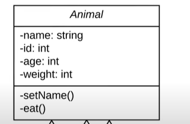
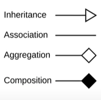
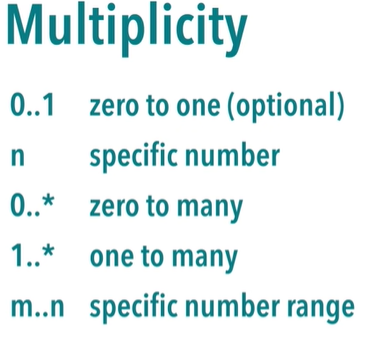

# UML

## access modifiar in uml
---
 - **-** private
 - **+** public
 - **#** protected
 - **~** package

 ## relation in uml
 ---

 - **-->** from child class to base class `inheritance`.  
 - in we but `<<ClassNAme>>` around class name OR write class name in *italic* that mean it is an `abstract`

- `aggregation` one of part but part can exist without the father `the head on the father` 

- `composition` one of part but part can **NOT** exist without the father `the head on the father`   

## Multiplicity
----

